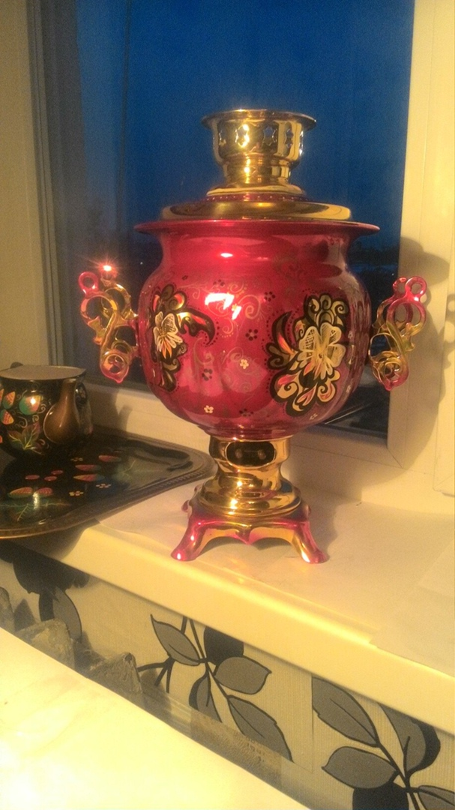

# Как инди-разработчику найти художника для своей игры и сэкономить $500

Моим первым в жизни «фрилансом» была роспись самоваров на заказ.

Тогда я еще не знала, что фриланс называется фрилансом, правки бывают бесконечными, а заказчик может кинуть. Я хотела бы знать, как сотрудничают нормальные люди, в тот момент, когда бесплатно создавала эскизы с «Астана-Байтерек» и без предоплаты расписывала третий поднос подряд.

## Вот, кстати, самовары, если интересно (простите за качество фото)

Один из самоваров, что я расписывала:

Еще вместе с самоваром обычно поднос и чайник берут. Чайника не нашла, а поднос вот:

А мой самоварчик в процессе росписи:

Недавно нашла самовар, который расписала под космос (для себя, заказчики скучные, им хохлому подавай). Жаль, правда, что недоделала его.

Я бы хотела, чтобы те, кто работают на фрилансе / с фрилансерами, увидели этот пост. Перевод ниже про сотрудничество инди-разработчика и художников-иллюстраторов, но в нём есть общие этические правила, которые сгодятся для фриланса в целом.

>Еще я веду канал в Telegram: GameDEVils, делюсь там клевыми материалами про геймдизайн, разработку и историю игр.

## Что я узнал, потратив $500 на тестирование художников для моей игры

Всем привет! В прошлом месяце я начал процесс поиска художника, который мог бы сделать несколько портретов по пояс для моей игры. Я прочитал пару постов и статей о том, чего ожидать, и некоторые общие правила вежливости, которыми я хотел бы поделиться со всеми вами, а также чему я научился на этом пути.

## Где искать художника?

Вероятно, это первое, о чем вы подумаете. Есть много мест, но я сосредоточился на следующих:

### Сайты для фрилансеров:

* Fivver

Единственный сайт для найма фрилансеров, который я лично опробовал. Пообщался с парой художников, в итоге остался один.

### Сайты с портфолио:

* Artstation

Там вы сможете искать арты по категориям (типа «Medieval», «dark fantasy», «realistic») и получать действительно хороший результат. Вы можете просто написать понравившемуся художнику, кликнув на фото. Обычно они принимают заказы, если так указано в разделе «about me».

* DeviantArt

Очень похоже на Artstation, но мне это показалось более рискованным вариантом. В вашем случае может быть иначе.

* Instagram

Я попытался посмотреть несколько портфолио, но начинает раздражать, когда тебя постоянно просят создать учетную запись. Я не хочу, чтобы у Facebook были мои данные, так что я перестал просматривать портфолио тут.

### Reddit:

* r/HungryArtists

На старом добром Reddit есть сообщества для всего. В итоге я нашел  своего художника в сабреддите r/HungryArtists. Самое замечательно, что тут нужно гораздо меньше предварительных усилий. Вместо того, чтобы просматривать сотни артов, вы просто пишете пост и наблюдаете, как люди начинают там флудить. Предостережение — довольно много людей не обладали навыками в том художественном стиле, о котором я писал. Но у них были добрые намерения, так что не стоит их корить за попытку.

## Как вести переговоры с художниками?

Я невероятно плох в переговорах, но я сделал несколько выводов для себя:

* Просите скетчи (черновые наброски).

Не думайте, что вам сразу нужно платить за финальный продукт. Есть способ удешевить расходы на «тестирование» художественных стилей, просто спросите сколько художник берет за черновой набросок. Некоторые художники даже делали скетчи бесплатно, но я не считаю это нормой, и не прошу об этом, если они сами не предложат. Обычно скетч стоит от $10 до $30 за штуку. В начале я про это не знал и потратил некоторую сумму на работы, которые мне не подходили, хотя уже на стадии эскиза я это понимал. Плюс, если вам понравится скетч, вы всегда можете заплатить художнику, чтобы он доработал его.

Будьте предельно честны, если вы собираетесь использовать арты для коммерческой игры, а не для личного пользования.

Хотя в каждом своем сообщения я писал об использовании артов в своей игре, люди не включали в расценки «коммерческое использование». Я плачу кому-то за создание арта для меня, а он продолжает владеть всеми правами на этот арт? Оказалось, что довольно много художников, которых я нашел, так и работали. Честно говоря, меня оттолкнуло то, что они ожидают оставить все права на работы, за которые плачу. Что подводит меня к следующему пункту:

* Уточняйте все в договоре

Я не юрист, и это — не юридическая консультация. Лично я использовал https://docontract.com/, но вы можете поискать сами или даже нанять юриста, если очень беспокоитесь по этому вопросу. Самое приятное в Fivver, что они берут на себя эту часть. Укажите, что у вас есть коммерческие права на игру, и разрешаете ли вы сохранять им «право собственности». Я мог видеть, как этот этап стреляет в колено людям, которые не были осторожны с ним

*Некоторые договорные понятия

Цена, срок сдачи, количество правок, которые вы можете вносить.

## Как выглядел процесс

Почти со всеми художниками я работал примерно одинаково.

1. Согласовать цену.
Вы обычно платите половину авансом, а половину после завершения работы. Я бы не стал платить авансом всю сумму, хотя некоторые художники работают именно так.

2. Согласовать условия договора.
Некоторые художники считали это лишним, но вам решать, стоит ли дальше двигаться без договора. Как минимум, убедитесь, что вы согласовали условия сотрудничества в письменной форме по почте, чтобы взаимно не разочароваться.

3. Отправить описание того, что нужно рисовать.
Я создал двухстраничный google документ для каждого персонажа. В основном это были краткие описания или изображения, чтобы показать, как нужно изобратьзить определенные части (например, волосы). Я добавил «персональный раздел», но не учитывал фон, сказал, что если будет нужен фон, они могут его запросить у меня.

4. Художник возвращается со скетчем.
Это будет очень грубый черновик, но вы получите представление о конечном продукте. Это отличное время для того, чтобы попросить доработки или изменения, т.к. на этом этапе художнику проще всего их внести.

5. Художник возвращается с готовым рисунком.
Некоторые заканчивали наборок и вносили какие-то изменения, некоторые сразу переходили к работе в цвете. Тут все зависит от художника. Большинство художников сразу сообщаю сколько правок включает их вознаграждение, так что будьте осторожны с этим. Вы говорите, когда вы довольны результатом и на этом все.

## Общая вежливость

* Не заставляйте художника гонятся за деньгами. Это быстрый способ испортить отношения. Как только вы согласовали цену, отправьте предоплату, сразу же после завершения отправьте остаток (если вы договорились делить платеж на части). 

*Отвечайте как можно быстрее. Никто не любит оставаться в подвешенном состоянии. Так вы получите свой арт быстрее.

*Будь прямолинейны. Это то, над чем мне еще стоит поработать, потому что я не хочу казаться грубым. Если вас что-то не устраивает, вежливо сообщите об этом художнику. Я бы смог сэкономить часть денег, если бы я следовал этому пункту. Я позволял художникам заканчивать работы, которые мне не очень подходили еще на этапе эскиза. 

*Не просить работать бесплатно. Просто не надо. Некоторые могут предложить бесплатные скетчи, но я никогда не стал бы сам просить об этом. 

*Не предлагайте процент с продаж. Я делал так один раз, и это было для того, чтобы исключить оплату за «коммерческое использование», т.к. моя игра еще не продается и я не знаю, понадобится ли мне вообще это «коммерческое использование». Я бы никогда не предложил расплачиваться за сам арт «будущими продажами».

